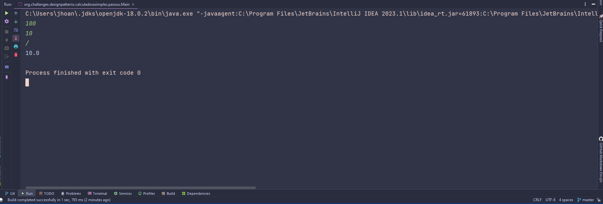

## Desafio Implementando uma Calculadora Simples com Padrão Strategy

### Descrição
Você foi designado para criar uma calculadora simples em Java, aplicando o padrão
Strategy para representar as operações matemáticas.

---

#### Entrada 🔌
O programa deve solicitar ao usuário dois números e a operação desejada. 
As operações podem ser especificadas pelos seguintes sinais: + para soma, - para subtração, * para multiplicação e / para divisão. O usuário deve inserir o sinal correspondente à operação desejada.

---
#### Saída 💡
A calculadora deve utilizar o padrão Strategy para realizar a operação escolhida e exibir o resultado.

---

### Exemplos 🕯

| Entrada | 
|---------|
| 100     | 
| 10      | 
| /       | 

#### Saída :
    1 - 10.0

| Entrada | 
|---------|
| 9       | 
| 4       | 
| *       | 

#### Saída :
    1 - 36.0

| Entrada | 
|---------|
| 4       | 
| 3       | 
| +       | 

#### Saída :
    1 - 7.0

---
### Saída da minha implementação

