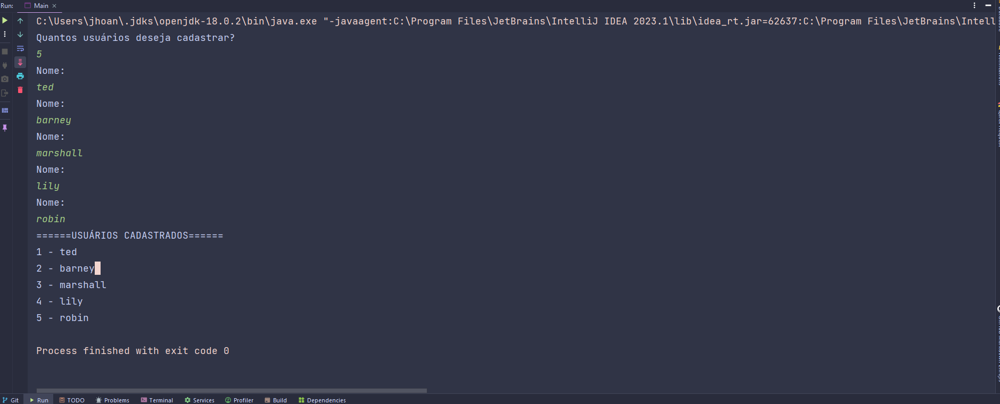

## Desafio  Padronizando um Sistema de Gerenciamento de Usuários 🤖

### Descrição
O Singleton é uma abordagem de design de software que visa assegurar a existência de apenas uma instância de uma classe e fornecer um ponto centralizado para acessá-la. Isso é especialmente benéfico em contextos nos quais é desejável manter uma única ocorrência de uma classe responsável pelo controle de um recurso compartilhado, como configurações, conexões de banco de dados ou caches.

Neste desafio, você deve criar um sistema de gerenciamento de usuários que permita adicionar e listar usuários. Você tem a opção de implementar o padrão Singleton para garantir que haja apenas uma instância do gerenciador de usuários em toda a aplicação. No entanto, a implementação do padrão Singleton é opcional e você pode optar por seguir uma abordagem diferente para resolver o desafio, se preferir.

---
#### Especificações ⛏

- [x] Crie uma classe User com os seguintes atributos: id (inteiro) e name (string).
- [x] Implemente uma classe UserManager que siga o padrão Singleton. Esta classe deve possuir as seguintes funcionalidades:
  
  - a. Adicionar um novo usuário ao sistema, recebendo o nome como entrada. 
  - b. Listar todos os usuários cadastrados.
- [x] No programa principal (main), siga as etapas abaixo:
    - a. Solicite ao usuário a quantidade de usuários que deseja cadastrar.
    - b. Peça ao usuário para informar os nomes dos usuários, um por linha.
    - c. Após receber os nomes e cadastrar os usuários, liste os usuários cadastrados.
---

#### Entrada 🔌
Um número inteiro representando a quantidade de usuários que o usuário deseja cadastrar.

Para cada usuário a ser cadastrado, uma string contendo o nome do usuário.

---
#### Saída 💡
Uma lista com os nomes dos usuários cadastrados.

---

### Exemplos 🕯

| ID | Nome  |
|----|-------|
| 1  | Ada   | 
| 2  | Linus | 

#### Saída :
    1 - Ada
    2 - Linus

| ID  | Nome  |
|-----|-------|
| 1   | Grace | 
| 2   | Alan  | 
| 3   | Steve |

#### Saída :
    1 - Grace
    2 - Alan
    3 - Steve

| ID | Nome     |
|----|----------|
| 1  | Tim      | 
| 2  | Margaret | 
| 3  | John     |
| 4  | Richard  |

#### Saída :
    1 - Tim
    2 - Margaret
    3 - John
    4 - Richard

---
### Saída da minha implementação

